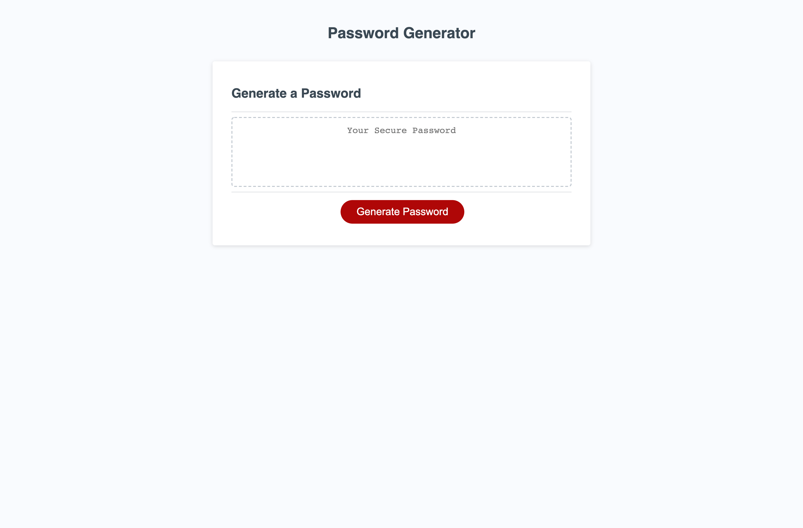

# Password-Generator

## Description

A strong randomly generated password is essential for protecting ones personal and professional data. Passwords are used regularly to access important account information in the workplace as well at home on our personal computers and mobile devices. Identity theft and data breaches are serious issues that can be easily minimized with the use of a strong multicharacter type password. Having access to an easy to use Password Generator should be a requirement that every work environment implements.

## Usage

1. Click the Generate Passwork button.
2. Enter how many characters you would like your password to contain.
3. Determine if you would like to include each character type by clicking OK.
4. Copy and paste your new password!

## Mock-up

The following image shows the web application's appearance and functionality:

[Deployed Application](https://djbalabis.github.io/Password-Generator/)